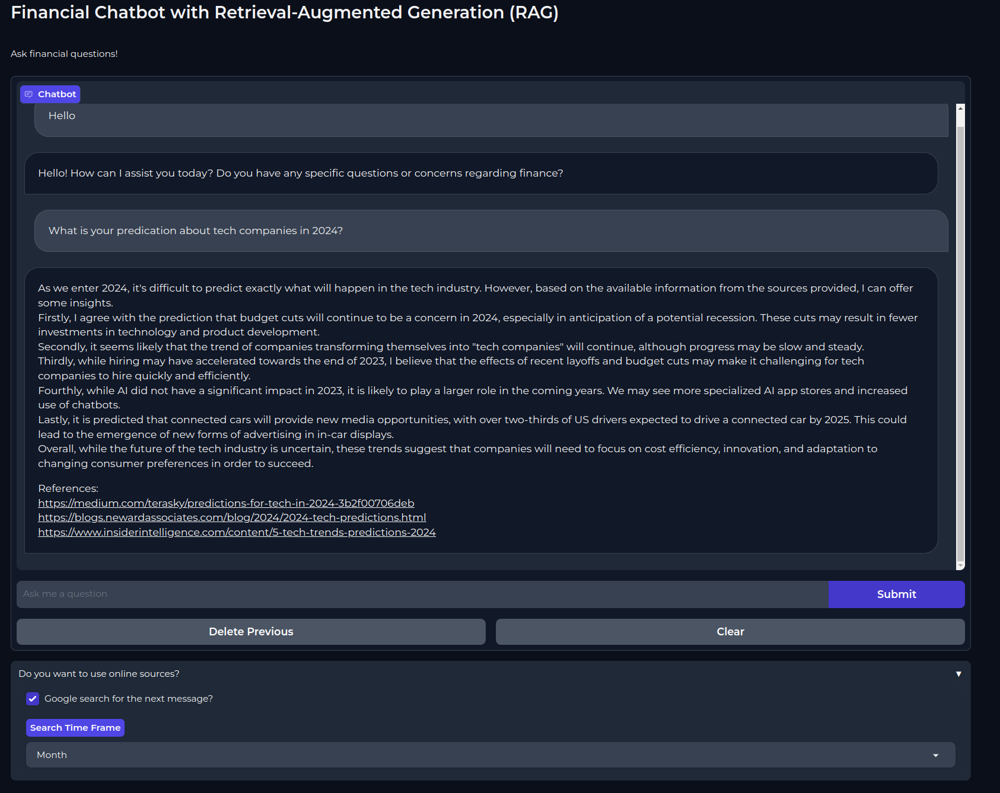

# Financial Chatbot with Retrieval-Augmented Generation (RAG)

This is a Python-based financial chatbot equipped with **Retrieval-Augmented Generation (RAG)**. The chatbot seamlessly interacts with users, addressing financial queries by amalgamating the top insights from online sources with the user's input.

## Overview




The financial chatbot follows the following workflow to ensure efficiency, accuracy and currency of information:

1. **User Query**: Receive and process the user's financial question.
2. **Summarization**: Summerize lengthy user prompts for an enhanced online search experience.
3. **Google Search**: Perform an online search to extract the top 3 results from Google.
4. **Web Scraping**: Utilize Selenium to extract text content from the searched websites (Chrome installation required).
5. **Text Refinement**: Eliminate short paragraphs, duplicates, and unnecessary new lines to ensure superior information quality from web scraping.
6. **Semantic Search**: Employ the robust *"all-mpnet-base-v2"* model for encoding the user query and online sources, enhancing semantic search capabilities.
7. **Summarization (Again)**: Independently summarize each paragraph to prevent information loss and optimize chatbot responsiveness.
8. **Prompt Engineering**: Combine the user query and summarized paragraphs using prompt engineering.
9. **Qwen Model**: Leverage the high-quality *"Qwen/Qwen-14B-Chat-Int4"* model for response generation.
10. **Response and References**: Provide the user with the generated response and references.

## Usage

To employ the financial chatbot, follow these simple steps:


1. Clone the repository and go to the downloaded file.
```python
git clone https://github.com/FzS92/chatbot_rag.git
cd chatbot_rag
```


3. Create a new enviornment and install the required dependencies:
```python
conda create -n fschat python=3.8
conda activate fschat
pip install -r requirements.txt
```

Optional: To enhance efficiency and reduce memory usage, you may want to install the following dependencies:

```python
git clone https://github.com/Dao-AILab/flash-attention
cd flash-attention && pip install .
pip install csrc/layer_norm
pip install csrc/rotary
```


3. Run the `main.py` script.

```python
python main.py
```

Launch the Gradio ChatInterface. You will see a link in the terminal.
Pose financial questions, and witness the chatbot respond with the top online information.
